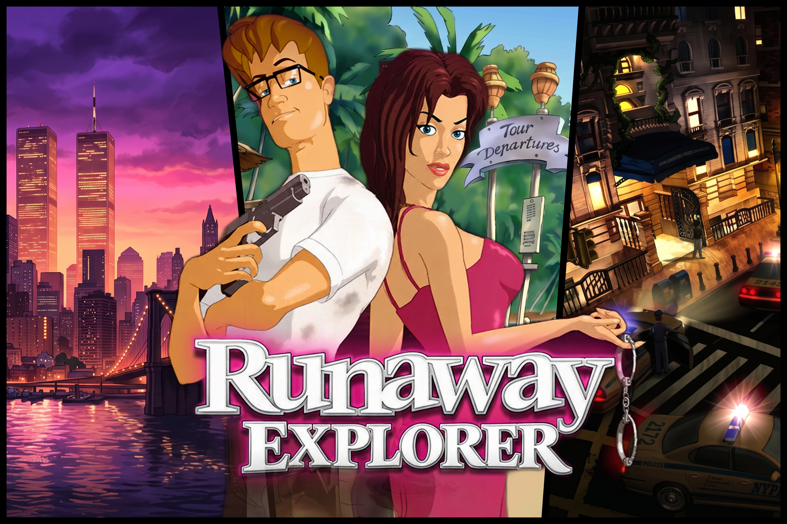
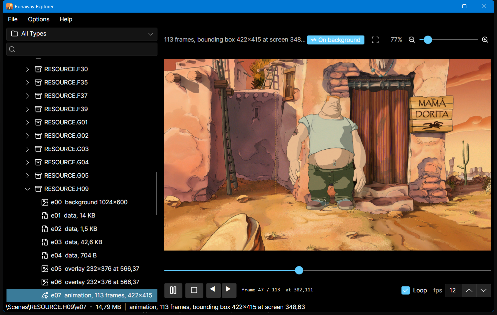

<p align="center"></p>

# Runaway Explorer

A cross-platform viewer for the game assets of the *Runaway* trilogy by Pendulo Studios:
- **Runaway: A Road Adventure** (2001)
- **Runaway 2: The Dream of the Turtle** (2006)
- **Runaway: A Twist of Fate** (2009)

Point it at an install for any of the three games (or configure all three in Settings) and browse every scene background, overlay, sprite animation, music track,
sound effect, voice line, lip-sync track and cutscene -- and export any of them.

The games keep everything in nameless offset-table archives with no file names, no extensions and no
headers; the formats were reverse-engineered from the Steam releases and are written up in
[`docs/formats/`](docs/formats/README.md).



## Features

- **Whole-install browsing.** Supports all three games (*Runaway 1*, *Runaway 2*, and *Runaway 3*). Every archive is scanned once and its entries classified by what they
  actually are (a byte-exact structural check, not a guess). The tree is organised by kind: Scenes,
  Music, Ambient & SFX, Cinematic Audio, Voice, Lip-sync, Video, Global Data. Includes a pre-computed
  hash-based scan cache for known files so first-time loading is near-instant (~200 ms for R1, ~900 ms for R2, ~700 ms for R3).
- **Backgrounds, scene masks and overlays.** Raw RGB565 rasters (with width recovered from green-channel stride sweep, supporting widescreen 1280×720 and panoramic 3016×770 resolutions),
  positioned row-record overlays (props, foreground layers, title cards, UI), continuous and sparse RLE scene masks
  (interaction hotspots, walkboxes, and depth planes). Overlays and scene masks can be drawn on their
  scene's background (in full color or greyscale, with 55% opacity for masks) at the exact coordinates
  the game uses.
- **Sprite animations.** Frame-by-frame playback with scrubbing, stepping, looping and an adjustable
  frame rate, either on the animation's own bounding box or composited over the scene background at
  the frames' absolute coordinates. Supports R1 palette-based/RGB565 sprites, R2 truecolor RGBA
  sprites with paired 8-bit alpha channels, and R3 14-byte frame / 7-byte segment sprites.
- **Sound & Video.** Music (16 kHz in R1, WAV/MP3 in R2), ambient/SFX and cinematic audio (22 kHz),
  voice lines (16 kHz in R1, 22 kHz across 10,000+ clips in R2, 7,200+ clips in R3), and Bink cutscenes with restored headers played via LibVLC with dedicated volume sliders, mute toggles (M),
  and interactive waveform click/drag seeking.
- **Export & Clipboard.** Single entries or whole folders: PNG for images and scene masks, **animated PNG** or
  numbered **image sequence** (prompted via an in-app modal, with per-frame screen positions) for
  animations, WAV for audio, restored `.bik` for video, text for lip-sync tracks, raw bytes for anything
  else. Easily copy images and animation frames to the clipboard (Ctrl+C).
- **Quick navigation & localisation.** Full English and Spanish interface with human-friendly chapter
  and scene names for all three games, resource type filter, name search with quick clear (Esc), tree expand/collapse all,
  clickable status bar paths, a fuzzy command palette (Ctrl+P), keyboard shortcuts (F1 lists them),
  and remembered selection per install.
- **Multi-game configuration.** Switch between games seamlessly with separate install folder paths
  managed in the Settings dialog and top toolbar selector.
- **Update checks.** Optionally asks GitHub whether a newer release exists, then links you to it. Off
  until you say yes.

## Building

Requires the **.NET 10 SDK**. Builds and runs on Windows and Linux (Avalonia UI).

```
dotnet build RunawayExplorer.slnx
dotnet run --project src/RunawayExplorer
dotnet test
```

Sound and video playback are backed by [LibVLC](https://www.videolan.org/vlc/libvlc.html). The
Windows build bundles it via NuGet; on Linux, install it from your distro's package manager (e.g.
`sudo apt install libvlc-dev vlc` on Debian/Ubuntu).

## Project layout

- `src/RunawayExplorer.Core/` -- archive readers, image decoders, PNG/APNG/WAV writers and the virtual
  file system. Engine-agnostic: no UI framework, no native dependencies.
  - `FileSystem/` -- the scene, audio, global, viseme and voice archive readers; the video keyfile;
    `VirtualFileSystem` (the categorised tree) and `ScanCache`.
  - `Formats/` -- `RasterDecoder`, `OverlayDecoder`, `SpriteDecoder`, `RleMaskDecoder`, `PngWriter`, `ApngWriter`, `WavWriter`.
  - `Metadata/` -- `SceneCatalog` (official chapter names, scene titles and bilingual descriptions).
  - `Settings/` -- persisted user preferences.
- `src/RunawayExplorer/` -- Avalonia UI.
  - `MainWindow.axaml` + code-behind -- the browser and the image, animation, sound, video and text viewers.
  - `Services/` -- resource loading, batch export, LibVLC glue, update check, localisation, logging.
  - `Views/` -- settings overlay, animation export overlay, command palette, about, shortcuts, message box, zoom controller.
- `tests/` -- xUnit suites for both projects; the UI suite runs real windows headlessly.
- `docs/formats/` -- the file-format reference.

## What is not decoded

- The per-scene data tables in every scene archive (1536, 43659 and 704 bytes) -- purpose unknown.
- `RESOURCE.000` (fonts, UI atlas, localised text bitmaps) and `Resource.001` (the character sprite
  library): their codecs are only partly understood. Shown as hex dumps.
- `RESOURCE.003` (phrase tables). Dialogue is not stored as text anywhere in the game data.
- Animation timing. The files carry none; playback and APNG export use the rate you choose (15 fps by default).

## Author

Developed by **Victor Gomez** ([@Victor-Gomez](https://github.com/Victor-Gomez)).

## Acknowledgements

The formats were worked out by reading the archives and the game executable; there was no prior
public documentation to build on. The single most useful lesson is recorded at the end of
`docs/formats/README.md`: if a decoder needs a heuristic to find where an image starts, look again at
the container.

*Runaway: A Road Adventure* and *Runaway 2: The Dream of the Turtle* are trademarks of their respective owners. This is an unaffiliated fan-made
tool and ships no game data.

The UI icons are from **[Lucide](https://lucide.dev)** (ISC licensed).
